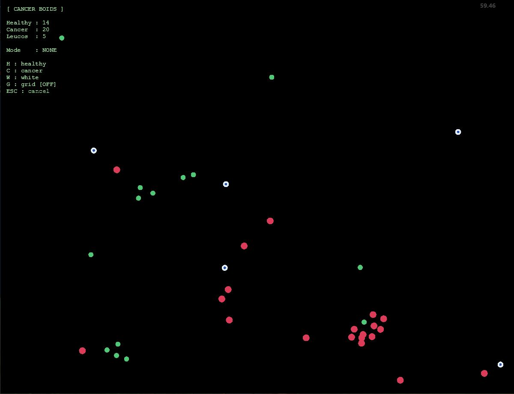
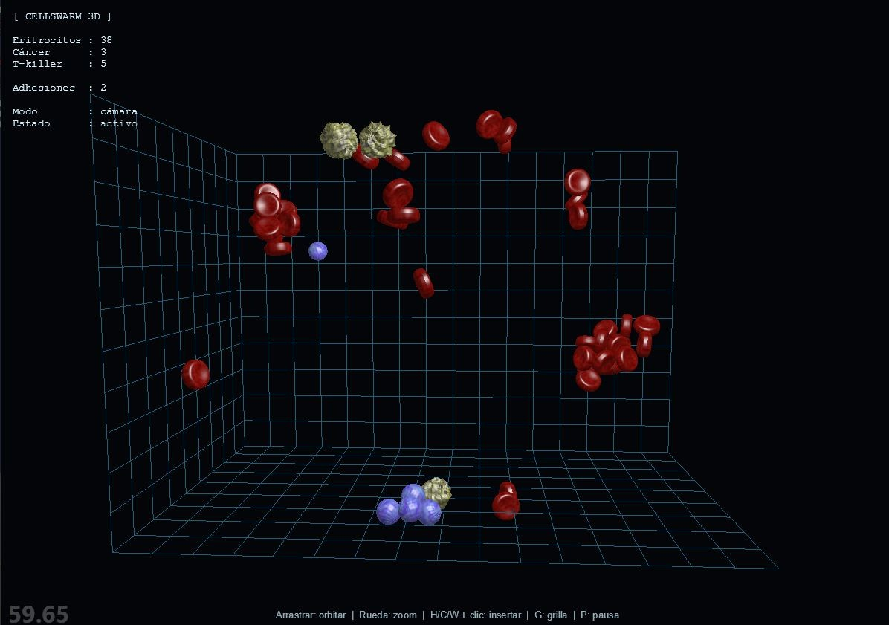
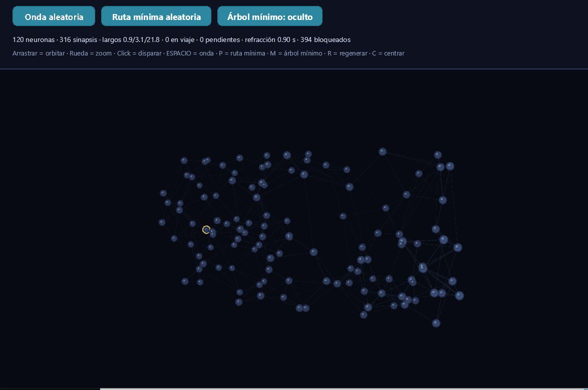
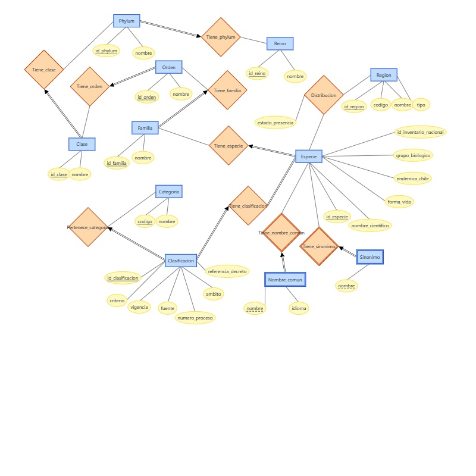

<div align="center">

<h1>Proyectos</h1>

<h3>Simulaciones gráficas,bases de datos y proyectos escalables</h3>


<p>
  Propuestas variadas de proyectos e ideas para desarrollar con respecto a tematicas de biologia, computacion grafica, teoria de grafos o simplemente pruebas de proyectos escalables.
</p>

</div>

---

## Contenido

- [Descripción general](#descripción-general)
- [Cells'War](#cellswar)
- [Redes de impulsos nerviosos](#redes-de-impulsos-nerviosos)
- [Alcance de los modelos](#alcance-de-los-modelos)
- [Proyecto de Scala](#buenas-practicas-y-POO)
- [Base de Datos](#Base-de-datos-biodiversidad)


## Descripción general

| Simulación | Objetivo principal | Tecnologías destacadas |
| --- | --- | --- |
| **Cells'War** | Representar la interacción entre células normales, células blancas y células cancerígenas. | NumPy, SciPy, Pyglet, ModernGL y KD-Tree |
| **Redes de impulsos nerviosos** | Representar la interacción del tejido nervioso y sus principales mecanismos. | NumPy,Pyglet|
| **Biodiversidad de Chile** | Modelar información sobre especies, regiones y clasificaciones de conservación. | Modelo entidad-relación, modelo relacional y FNBC |
| **Scala y POO** | Modelar entidades y programar turnos de un videojuego. | Scala 3, POO y MUnit |

> [!NOTE]
> Los proyectos son modelos visuales simplificados. Su propósito es explorar
> técnicas de simulación y computación gráfica, no reproducir con exactitud un
> sistema biológico o físico real.

---

## Cells'War


**Cells'War** es una simulación semi-realista de las interacciones entre tres
poblaciones celulares:

- células normales;
- células blancas;
- células cancerígenas.

El proyecto incluye dos variantes, **Cells2D** y **Cells3D**. Ambas comparten el
mismo planteamiento general, pero emplean herramientas y enfoques de
representación diferentes.

### Características principales

- Visualización de la distribución espacial mediante un **mapa de calor**.
- Uso de un **KD-Tree** para acelerar las consultas de proximidad.
- Modificación de las poblaciones celulares en tiempo real.
- Posibilidad de probar diferentes cantidades iniciales de cada tipo de célula.
- Propagación del cáncer mediante un crecimiento acumulativo: una célula
  infectada muta y puede infectar nuevos objetivos.

### Consideraciones técnicas

1. El espacio de simulación es intencionalmente acotado para favorecer las
   consultas espaciales y el comportamiento del KD-Tree.
2. El modelo de infección no incorpora regeneración ni decaimiento de la
   población cancerígena.
3. Cada población celular se representa mediante una versión generalizada de
   su comportamiento.
4. El modelo prioriza la experimentación visual y computacional por sobre la
   precisión biomédica.

### Requisitos

```text
numpy>=1.26
scipy>=1.12
pyglet>=2.1
moderngl>=5.10
pillow>=10.0
```

---

---
## Redes de impulsos nerviosos


### Características principales

-Utiliza propiedades de grafos, vertices y aristas para modelar una red de neuronas.

-Los vertices representan las neuronas y las aristas las conexiones(que vendrian siendo las conexiones entre dendritas), trae cierta componente grafica para mejorar la visualizacion de los organismos 

-Para evitar loops de propagacion existe un parametro de refraccion que funciona como ventana de tiempo. 

-Utiliza algoritmos como dikjstra para alcanzar la distancia mas corta entre 2 neuronas.

-Utiliza Kruskall para encontrar el arbol de costo minimo.

### Controles

| Tecla | Acción |
| :---: | --- |
| `R` | Reinicia la red. |
| `Click izquierdo` | Inicia un pulso desde una neurona. |
| `P` | Genera un pulso desde 2 neuronas aleatorias. |
| `M` | Arbol de costo minimo. |
| `Espacio` | Genera un pulso en algun punto aleatorio. |

### Requisitos

-Pyglet

-Numpy 

---
###Bases de datos: Biodiversidad de Chile

**Proyecto académico grupal**  
**Etapa actual:** modelado conceptual y relacional (Hito 1).

Diseño de una base de datos para organizar información sobre especies presentes en Chile y facilitar la consulta de su taxonomía, distribución regional y estado de conservación.

**Aspectos del modelo:**

- Jerarquía taxonómica desde reino hasta especie.
- Distribución de especies por región.
- Nombres comunes y sinónimos de cada especie.
- Clasificaciones de conservación actuales e históricas.
- Modelo entidad-relación, esquema relacional y análisis de FNBC.

**Modelo entidad-relación**



> **Siguiente etapa:** implementar la base de datos y desarrollar una aplicación web pública con búsqueda y filtros.


---

###POO· Sistema de turnos en Scala

**Proyecto académico · Scala 3 · MUnit**  
**Etapa actual:** modelo del juego y programador de turnos.

Desarrollo de las estructuras de un videojuego por turnos: personajes, enemigos, armas, pociones, paneles de mapa y acciones.

**Aspectos implementados:**

- Jerarquías de clases para unidades, utilizables y acciones.
- Paneles con coordenadas, unidades y referencias a paneles adyacentes.
- Barras de acción basadas en el peso de cada unidad y su arma equipada.
- `TurnScheduler` que detecta las unidades listas y asigna el siguiente turno según el excedente de barra.
- Pruebas unitarias con MUnit para las entidades y el programador de turnos.

> **Siguiente etapa:** conectar estas mecánicas en `GameController` para ejecutar las acciones y el flujo del combate.

## Alcance de los modelos

Estas simulaciones permiten estudiar y visualizar:

- interacciones locales entre agentes;
- estructuras de búsqueda espacial;
- crecimiento y propagación de poblaciones;
- Estudio del uso de los grafos y sus propiedades
- Aplicaciones de tecnicas graficas para el desarrollo de aplicaciones relacionadads con la biologia

Los resultados deben interpretarse como aproximaciones computacionales con
fines educativos y experimentales.

---

<div align="center">

Desarrollado como una exploración de **simulación**, **física** y
**computación gráfica**.


</div>


